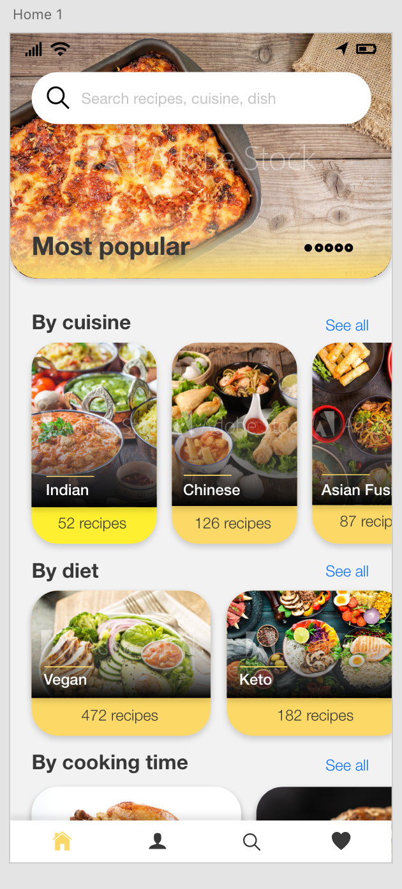
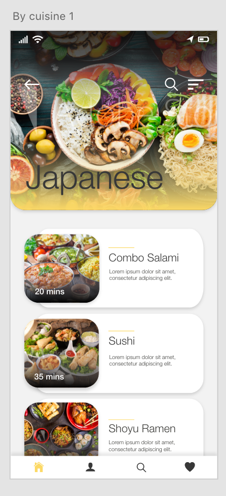
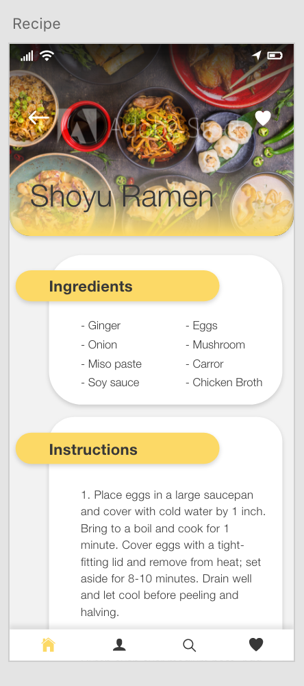

# Home Chef

A mobile app project aiming to provide cooking recipes with smart lookup taking into accounts user's diets, allergies and what's in the fridge.

# Developed with:
**Frontend**
- Flutter

**Backend:** https://github.com/vladalexey/api_homechef_backend 
- Nodejs
- PostgreSQL

# Spoonacular API
Used for Recipe lookup with diverse search options
